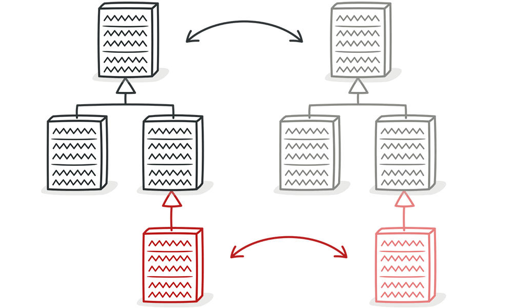
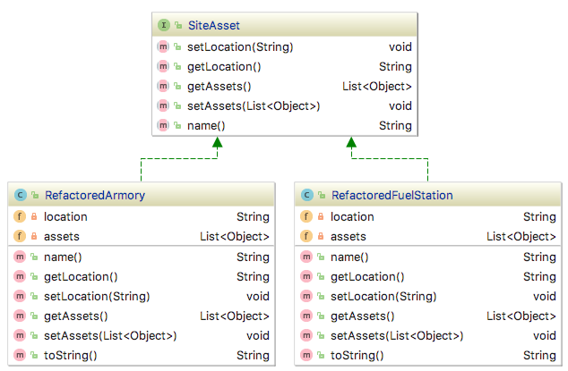
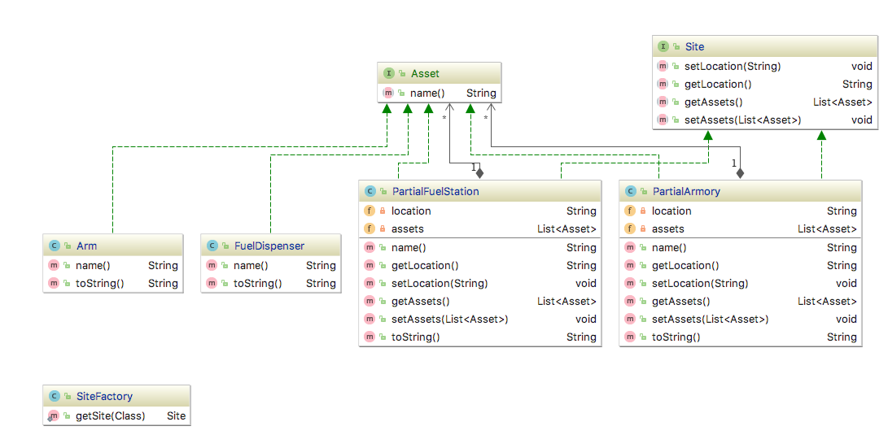

# PROGRAMACION - Refactoring

## Estudiantes
  * Alexander Mamani Yucra
  * Ariel Alcocer Rodriguez
  
## Bad Smell: Parallel Inheritance Hierarchies

 

### Descripción
Parallel Inheritance Hierarchies es un caso especial de Shotgun Surgery. En este caso, cada que se crea una subclase 
de una clase, se tiene que también crear una subclase de otra clase. Una forma de reconocer este tipo de Bad Smell es 
a través de los prefijos.

Parallel Inheritance Hierarchies sucede cuando un árbol de herencia depende de otro árbol de herencia por composición, 
y ellos mantienen una relación especial donde una subclase de una herencia dependiente debe depender de una subclase 
particular de otra herencia.

### Causas
 * Fallas al identificar la responsabilidad de cada clase (Aquí se rompe el principio de responsabilidad única).
 * Exceso por tratar de separar funcionalidades en interfaces separadas.
 * Fallas al introducir diseños de patrones correctos.
 * Código duplicado.
 * Malos relacionamientos.
 * Código inmantenible.
        
      

### Solución
   
Una estrategia para solucionar este problema consiste en crear instancias de una jerarquía y referenciarlas a instancias 
de otra jerarquía, luego remover la jerarquía en la clase referenciada usando las técnicas de **Move Method** y 
**Move Field**.

## Código fuente
### Problema 1


* Admin.java
```java
package bo.edu.umss.programming.exercise2.problem1;


import bo.edu.umss.programming.exercise2.problem1.domain.*;

import java.util.ArrayList;
import java.util.List;

public class Admin {
    public static void main(String args[])  {
        Site armory = new Armory();
        armory.setLocation("North");
        List<Asset> arms = new ArrayList<>();
        Asset arm1 = new Arm();
        arms.add(arm1);
        armory.setAssets(arms);
        System.out.println(armory);

        Site fuelStation = new FuelStation();
        fuelStation.setLocation("South");
        List<Asset> fuelDispensers = new ArrayList<>();
        Asset fuelDispenser1 = new FuelDispenser();
        fuelDispensers.add(fuelDispenser1);
        fuelStation.setAssets(fuelDispensers);
        System.out.println(fuelStation);

    }
}
```

* Arm.java
```java
package bo.edu.umss.programming.exercise2.problem1.domain;

public class Arm implements Asset {
    @Override
    public String name() {
        return "Arm";
    }

    @Override
    public String toString() {
        return name();
    }
}

```

* Armory.java
```java
package bo.edu.umss.programming.exercise2.problem1.domain;

import java.util.List;

public class Armory implements Site {

    private String location;
    private List<Asset> assets;

    @Override
    public String getLocation() {
        return location;
    }

    @Override
    public void setLocation(String location) {
        this.location = location;
    }

    @Override
    public List<Asset> getAssets() {
        return assets;
    }

    @Override
    public void setAssets(List<Asset> assets) {
        this.assets = assets;
    }

    @Override
    public String toString() {
        return "Armory{" +
                "location='" + location + '\'' +
                ", assets=" + assets +
                '}';
    }
}

```

* Asset.java
```java
package bo.edu.umss.programming.exercise2.problem1.domain;

public interface Asset {
    String name();
}

```

* FuelDispenser.java
```java
package bo.edu.umss.programming.exercise2.problem1.domain;

public class FuelDispenser implements Asset {

    @Override
    public String name() {
        return "Fuel Dispenser";
    }

    @Override
    public String toString() {
        return name();
    }
}

```

* FuelStation.java
```java
package bo.edu.umss.programming.exercise2.problem1.domain;

import java.util.List;

public class FuelStation implements Site {
    private String location;
    private List<Asset> assets;

    @Override
    public String getLocation() {
        return location;
    }

    @Override
    public void setLocation(String location) {
        this.location = location;
    }

    @Override
    public List<Asset> getAssets() {
        return assets;
    }

    @Override
    public void setAssets(List<Asset> assets) {
        this.assets = assets;
    }

    @Override
    public String toString() {
        return "FuelStation{" +
                "location='" + location + '\'' +
                ", assets=" + assets +
                '}';
    }
}

```

* Site.java
```java
package bo.edu.umss.programming.exercise2.problem1.domain;

import java.util.List;

public interface Site {
    void setLocation(String location);
    String getLocation();
    List<Asset> getAssets();
    void setAssets(List<Asset> assets);
}

```

#### Solución 1: Mantener las jerarquías paralelas y aprender a lidiar con ellas
* Ventajas
    * Preserva el principio de responsabilidad única SRP (Single Responsibility Principle).
    * Código flexible.
* Desventajas
    * Cada vez que se quiera agregar una subclase en un lado de la jerarquía habrá que crear su contraparte.
    * Las jerarquías son acopladas. Cambios en un lugar podrían ser solicitados en otro lugar también.
    * Más difícil de mantener.

#### Solución 2: Usar una sola jerarquía

* Ventajas
    * Solo se debe mantener una jerarquía.
    * Fácil de mantener.
* Desventajas
    * Rompe el principio de responsabilidad única SRP (Single Responsibility Principle).

* Admin.java
```java
package bo.edu.umss.programming.exercise2.solution11;


import bo.edu.umss.programming.exercise2.solution11.domain.RefactoredArmory;
import bo.edu.umss.programming.exercise2.solution11.domain.RefactoredFuelStation;
import bo.edu.umss.programming.exercise2.solution11.domain.SiteAsset;

import java.util.ArrayList;
import java.util.List;

public class Admin {
    public static void main(String args[])  {
        SiteAsset armory = new RefactoredArmory();
        armory.setLocation("North");
        List<Object> arms = new ArrayList<>();
        SiteAsset arm1 = new RefactoredArmory();
        SiteAsset arm2 = new RefactoredArmory();
        arms.add(arm1);
        arms.add(arm2);
        armory.setAssets(arms);
        System.out.println(armory);

        SiteAsset fuelStation = new RefactoredFuelStation();
        fuelStation.setLocation("South");
        List<Object> fuelDispensers = new ArrayList<>();
        SiteAsset fuelDispenser1 = new RefactoredFuelStation();
        fuelDispensers.add(fuelDispenser1);
        fuelStation.setAssets(fuelDispensers);
        System.out.println(fuelStation);

    }
}

```

* RefactoredArmory.java
```java
package bo.edu.umss.programming.exercise2.solution11.domain;

import java.util.List;

public class RefactoredArmory implements SiteAsset {
    private String location;
    private List<Object> assets;

    @Override
    public String name() {
        return "Arm";
    }

    @Override
    public String getLocation() {
        return location;
    }

    @Override
    public void setLocation(String location) {
        this.location = location;
    }

    @Override
    public List<Object> getAssets() {
        return assets;
    }

    @Override
    public void setAssets(List<Object> assets) {
        this.assets = assets;
    }

    @Override
    public String toString() {
        return "RefactoredArmory{" +
                "location='" + location + '\'' +
                ", assets=" + assets +
                '}';
    }
}

```

* RefactoredFuelStation.java
```java
package bo.edu.umss.programming.exercise2.solution11.domain;

import java.util.List;

public class RefactoredFuelStation implements SiteAsset{
    private String location;
    private List<Object> assets;

    @Override
    public String name() {
        return "Fuel Dispenser";
    }

    @Override
    public String getLocation() {
        return location;
    }

    @Override
    public void setLocation(String location) {
        this.location = location;
    }

    @Override
    public List<Object> getAssets() {
        return assets;
    }

    @Override
    public void setAssets(List<Object> assets) {
        this.assets = assets;
    }

    @Override
    public String toString() {
        return "RefactoredFuelStation{" +
                "location='" + location + '\'' +
                ", assets=" + assets +
                '}';
    }
}

```

* SiteAsset.java
```java
package bo.edu.umss.programming.exercise2.solution11.domain;

import java.util.List;

public interface SiteAsset{
    void setLocation(String location);
    String getLocation();
    List<Object> getAssets();
    void setAssets(List<Object> assets);
    String name();
}

```

#### Solución 3: Crear jerarquías parciales

* Ventajas
    * Solo se debe mantener una jerarquía.
    * Adoptar cuando no se tiene clara la responsabilidad de clases.
    * Provee cierta flexibilidad.
* Desventajas
    * Rompe el principio de responsabilidad única SRP (Single Responsibility Principle).     
    
* Admin.java
```java
package bo.edu.umss.programming.exercise2.solution12;


import bo.edu.umss.programming.exercise2.solution12.domain.*;

import java.util.ArrayList;
import java.util.List;

public class Admin {
    public static void main(String args[]) throws IllegalAccessException, InstantiationException {
        Site armory = SiteFactory.getSite(PartialArmory.class);
        armory.setLocation("North");
        List<Asset> arms = new ArrayList<>();
        Asset arm = new Arm();
        arms.add(arm);
        armory.setAssets(arms);
        System.out.println(armory);

        Site fuelStation = SiteFactory.getSite(PartialFuelStation.class);
        fuelStation.setLocation("South");
        List<Asset> fuelDispensers = new ArrayList<>();
        Asset fuelDispenser = new FuelDispenser();
        fuelDispensers.add(fuelDispenser);
        fuelStation.setAssets(fuelDispensers);
        System.out.println(fuelStation);

    }
}

```

* Arm.java
```java
package bo.edu.umss.programming.exercise2.solution12.domain;

public class Arm implements Asset {
    @Override
    public String name() {
        return "Arm";
    }

    @Override
    public String toString() {
        return name();
    }
}

```

* Asset.java
```java
package bo.edu.umss.programming.exercise2.solution12.domain;

public interface Asset {
    String name();
}

```

* FuelDispenser.java
```java
package bo.edu.umss.programming.exercise2.solution12.domain;

public class FuelDispenser implements Asset {

    @Override
    public String name() {
        return "Fuel Dispenser";
    }

    @Override
    public String toString() {
        return name();
    }
}

```

* PartialArmory.java
```java
package bo.edu.umss.programming.exercise2.solution12.domain;

import java.util.List;

public class PartialArmory implements  Site, Asset {

    private String location;
    private List<Asset> assets;

    @Override
    public String name() {
        return "Arm";
    }

    @Override
    public String getLocation() {
        return location;
    }

    @Override
    public void setLocation(String location) {
        this.location = location;
    }

    @Override
    public List<Asset> getAssets() {
        return assets;
    }

    @Override
    public void setAssets(List<Asset> assets) {
        this.assets = assets;
    }

    @Override
    public String toString() {
        return "PartialArmory{" +
                "location='" + location + '\'' +
                ", assets=" + assets +
                '}';
    }
}

```

* PartialFuelStation.java
```java
package bo.edu.umss.programming.exercise2.solution12.domain;

import java.util.List;

public class PartialFuelStation implements Site, Asset {
    private String location;
    private List<Asset> assets;

    @Override
    public String name() {
        return "Fuel Station";
    }

    @Override
    public String getLocation() {
        return location;
    }

    @Override
    public void setLocation(String location) {
        this.location = location;
    }

    @Override
    public List<Asset> getAssets() {
        return assets;
    }

    @Override
    public void setAssets(List<Asset> assets) {
        this.assets = assets;
    }

    @Override
    public String toString() {
        return "PartialFuelStation{" +
                "location='" + location + '\'' +
                ", assets=" + assets +
                '}';
    }
}

```

* Site.java
```java
package bo.edu.umss.programming.exercise2.solution12.domain;

import java.util.List;

public interface Site {
    void setLocation(String location);
    String getLocation();
    List<Asset> getAssets();
    void setAssets(List<Asset> assets);
}

```

* SiteFactory.java
```java
package bo.edu.umss.programming.exercise2.solution12.domain;

public class SiteFactory {
    public static Site getSite(Class clazz) throws InstantiationException, IllegalAccessException   {
        return (Site) clazz.newInstance();
    }
}

```


### Problema 2


* Admin.java
```java
package bo.edu.umss.programming.exercise2.problem2;

import bo.edu.umss.programming.exercise2.problem2.domain.*;

public class Admin {

    public static void main(String args[])  {
        Asset arm = new Arm("1", "Arm1", "arm1", "001", "21", "0.5kg", "Poison");
        Tag rfIdTag = new RFIDTag();
        arm.setTag(rfIdTag);
        System.out.println(arm);

        Asset vehicle = new Vehicle("1", "Vehicle1", "vehicle1", "JDUA312331", "JSL2311", "Toyota", 2017, "Land Cruiser");
        Tag gpsTag = new GPSTag();
        vehicle.setTag(gpsTag);
        System.out.println(vehicle);

    }
}

```

* Arm.java
```java
package bo.edu.umss.programming.exercise2.problem2.domain;

public class Arm implements Asset {
    private String id;
    private String name;
    private String description;
    private Tag tag;
    private String serialNumber;
    private String caliber;
    private String weight;
    private String manufacturer;

    public Arm(String id, String name, String description, String serialNumber, String caliber, String weight, String manufacturer) {
        this.id = id;
        this.name = name;
        this.description = description;
        this.serialNumber = serialNumber;
        this.caliber = caliber;
        this.weight = weight;
        this.manufacturer = manufacturer;
    }

    @Override
    public String getId() {
        return id;
    }

    public void setId(String id) {
        this.id = id;
    }

    @Override
    public String getName() {
        return name;
    }

    @Override
    public void setName(String name) {
        this.name = name;
    }

    @Override
    public String getDescription() {
        return description;
    }

    @Override
    public void setDescription(String description) {
        this.description = description;
    }

    @Override
    public Tag getTag() {
        return tag;
    }

    @Override
    public void setTag(Tag tag) {
        this.tag = tag;
    }

    public String getSerialNumber() {
        return serialNumber;
    }

    public void setSerialNumber(String serialNumber) {
        this.serialNumber = serialNumber;
    }

    public String getCaliber() {
        return caliber;
    }

    public void setCaliber(String caliber) {
        this.caliber = caliber;
    }

    public String getWeight() {
        return weight;
    }

    public void setWeight(String weight) {
        this.weight = weight;
    }

    public String getManufacturer() {
        return manufacturer;
    }

    public void setManufacturer(String manufacturer) {
        this.manufacturer = manufacturer;
    }

    @Override
    public String toString() {
        return "Arm{" +
                "id='" + id + '\'' +
                ", name='" + name + '\'' +
                ", description='" + description + '\'' +
                ", tag=" + tag +
                ", serialNumber='" + serialNumber + '\'' +
                ", caliber='" + caliber + '\'' +
                ", weight='" + weight + '\'' +
                ", manufacturer='" + manufacturer + '\'' +
                '}';
    }
}

```

* Asset.java
```java
package bo.edu.umss.programming.exercise2.problem2.domain;

public interface Asset {
    String getId();
    String getName();
    void setName(String name);
    String getDescription();
    void setDescription(String description);
    Tag getTag();
    void setTag(Tag tag);
}

```

* GPSTag.java
```java
package bo.edu.umss.programming.exercise2.problem2.domain;

public class GPSTag implements Tag {

    @Override
    public String type() {
        return "GPS Tag";
    }

    @Override
    public String toString() {
        return "GPSTag{" +
                "type='" + type() + '\'' +
                '}';
    }
}

```

* RFIDTag.java
```java
package bo.edu.umss.programming.exercise2.problem2.domain;

public class RFIDTag implements Tag {

    @Override
    public String type() {
        return "RFID Tag";
    }

    @Override
    public String toString() {
        return "RFIDTag{" +
                "type='" + type() + '\'' +
                '}';
    }
}

```

* Tag.java
```java
package bo.edu.umss.programming.exercise2.problem2.domain;

public interface Tag {
    String type();
}

```

* Vehicle.java
```java
package bo.edu.umss.programming.exercise2.problem2.domain;

public class Vehicle implements Asset {
    private String id;
    private String name;
    private String description;
    private Tag tag;
    private String vin;
    private String licensePlate;
    private String brand;
    private Integer year;
    private String model;

    public Vehicle(String id, String name, String description, String vin, String licensePlate, String brand, Integer year, String model) {
        this.id = id;
        this.name = name;
        this.description = description;
        this.vin = vin;
        this.licensePlate = licensePlate;
        this.brand = brand;
        this.year = year;
        this.model = model;
    }

    @Override
    public String getId() {
        return id;
    }

    public void setId(String id) {
        this.id = id;
    }

    @Override
    public String getName() {
        return name;
    }

    @Override
    public void setName(String name) {
        this.name = name;
    }

    @Override
    public String getDescription() {
        return description;
    }

    @Override
    public void setDescription(String description) {
        this.description = description;
    }

    @Override
    public Tag getTag() {
        return tag;
    }

    @Override
    public void setTag(Tag tag) {
        this.tag = tag;
    }

    public String getVin() {
        return vin;
    }

    public void setVin(String vin) {
        this.vin = vin;
    }

    public String getLicensePlate() {
        return licensePlate;
    }

    public void setLicensePlate(String licensePlate) {
        this.licensePlate = licensePlate;
    }

    public String getBrand() {
        return brand;
    }

    public void setBrand(String brand) {
        this.brand = brand;
    }

    public Integer getYear() {
        return year;
    }

    public void setYear(Integer year) {
        this.year = year;
    }

    public String getModel() {
        return model;
    }

    public void setModel(String model) {
        this.model = model;
    }

    @Override
    public String toString() {
        return "Vehicle{" +
                "id='" + id + '\'' +
                ", name='" + name + '\'' +
                ", description='" + description + '\'' +
                ", tag=" + tag +
                ", vin='" + vin + '\'' +
                ", licensePlate='" + licensePlate + '\'' +
                ", brand='" + brand + '\'' +
                ", year=" + year +
                ", model='" + model + '\'' +
                '}';
    }
}

```

#### Solución 1: Mantener las jerarquías paralelas y aprender a lidiar con ellas
* Ventajas
    * Preserva el principio de responsabilidad única SRP (Single Responsibility Principle).
    * Código flexible.
* Desventajas
    * Cada vez que se quiera agregar una subclase en un lado de la jerarquía habrá que crear su contraparte.
    * Las jerarquías son acopladas. Cambios en un lugar podrían ser solicitados en otro lugar también.
    * Más difícil de mantener.

#### Solución 2: Usar una sola jerarquía

* Ventajas
    * Solo se debe mantener una jerarquía.
    * Fácil de mantener.
* Desventajas
    * Rompe el principio de responsabilidad única SRP (Single Responsibility Principle).

* Admin.java
```java
package bo.edu.umss.programming.exercise2.solution21;

import bo.edu.umss.programming.exercise2.solution21.domain.Arm;
import bo.edu.umss.programming.exercise2.solution21.domain.AssetTag;
import bo.edu.umss.programming.exercise2.solution21.domain.Vehicle;

public class Admin {

    public static void main(String args[])  {
        AssetTag arm = new Arm("1", "Arm1", "arm1", "001", "21", "0.5kg", "Poison");
        System.out.println(arm);

        AssetTag vehicle = new Vehicle("1", "Vehicle1", "vehicle1", "JDUA312331", "JSL2311", "Toyota", 2017, "Land Cruiser");
        System.out.println(vehicle);

    }
}

```

* Arm.java
```java
package bo.edu.umss.programming.exercise2.solution21.domain;

public class Arm implements AssetTag {
    private String id;
    private String name;
    private String description;
    private String serialNumber;
    private String caliber;
    private String weight;
    private String manufacturer;

    public Arm(String id, String name, String description, String serialNumber, String caliber, String weight, String manufacturer) {
        this.id = id;
        this.name = name;
        this.description = description;
        this.serialNumber = serialNumber;
        this.caliber = caliber;
        this.weight = weight;
        this.manufacturer = manufacturer;
    }

    @Override
    public String getId() {
        return id;
    }

    public void setId(String id) {
        this.id = id;
    }

    @Override
    public String getName() {
        return name;
    }

    @Override
    public void setName(String name) {
        this.name = name;
    }

    @Override
    public String getDescription() {
        return description;
    }

    @Override
    public void setDescription(String description) {
        this.description = description;
    }

    public String getSerialNumber() {
        return serialNumber;
    }

    public void setSerialNumber(String serialNumber) {
        this.serialNumber = serialNumber;
    }

    public String getCaliber() {
        return caliber;
    }

    public void setCaliber(String caliber) {
        this.caliber = caliber;
    }

    public String getWeight() {
        return weight;
    }

    public void setWeight(String weight) {
        this.weight = weight;
    }

    public String getManufacturer() {
        return manufacturer;
    }

    public void setManufacturer(String manufacturer) {
        this.manufacturer = manufacturer;
    }

    @Override
    public String type() {
        return "RFID Tag";
    }

    @Override
    public String toString() {
        return "Arm{" +
                "id='" + id + '\'' +
                ", name='" + name + '\'' +
                ", description='" + description + '\'' +
                ", serialNumber='" + serialNumber + '\'' +
                ", caliber='" + caliber + '\'' +
                ", weight='" + weight + '\'' +
                ", manufacturer='" + manufacturer + '\'' +
                ", tag='" + type() + '\'' +
                '}';
    }
}

```

* AssetTag.java
```java
package bo.edu.umss.programming.exercise2.solution21.domain;

public interface AssetTag {
    //ASSET
    String getId();
    String getName();
    void setName(String name);
    String getDescription();
    void setDescription(String description);

    //TAG
    String type();
}

```

* Vehicle.java
```java
package bo.edu.umss.programming.exercise2.solution21.domain;

public class Vehicle implements AssetTag {
    private String id;
    private String name;
    private String description;
    private String vin;
    private String licensePlate;
    private String brand;
    private Integer year;
    private String model;

    public Vehicle(String id, String name, String description, String vin, String licensePlate, String brand, Integer year, String model) {
        this.id = id;
        this.name = name;
        this.description = description;
        this.vin = vin;
        this.licensePlate = licensePlate;
        this.brand = brand;
        this.year = year;
        this.model = model;
    }

    @Override
    public String getId() {
        return id;
    }

    public void setId(String id) {
        this.id = id;
    }

    @Override
    public String getName() {
        return name;
    }

    @Override
    public void setName(String name) {
        this.name = name;
    }

    @Override
    public String getDescription() {
        return description;
    }

    @Override
    public void setDescription(String description) {
        this.description = description;
    }

    public String getVin() {
        return vin;
    }

    public void setVin(String vin) {
        this.vin = vin;
    }

    public String getLicensePlate() {
        return licensePlate;
    }

    public void setLicensePlate(String licensePlate) {
        this.licensePlate = licensePlate;
    }

    public String getBrand() {
        return brand;
    }

    public void setBrand(String brand) {
        this.brand = brand;
    }

    public Integer getYear() {
        return year;
    }

    public void setYear(Integer year) {
        this.year = year;
    }

    public String getModel() {
        return model;
    }

    public void setModel(String model) {
        this.model = model;
    }

    @Override
    public String type() {
        return "GPS Tag";
    }

    @Override
    public String toString() {
        return "Vehicle{" +
                "id='" + id + '\'' +
                ", name='" + name + '\'' +
                ", description='" + description + '\'' +
                ", vin='" + vin + '\'' +
                ", licensePlate='" + licensePlate + '\'' +
                ", brand='" + brand + '\'' +
                ", year=" + year +
                ", model='" + model + '\'' +
                ", tag='" + type() + '\'' +
                '}';
    }
}

```


#### Solución 3: Crear jerarquías parciales 

* Ventajas
    * Solo se debe mantener una jerarquía.
    * Adoptar cuando no se tiene clara la responsabilidad de clases.
    * Provee cierta flexibilidad.
* Desventajas
    * Rompe el principio de responsabilidad única SRP (Single Responsibility Principle).     
    
* Admin.java
```java
package bo.edu.umss.programming.exercise2.solution22;

import bo.edu.umss.programming.exercise2.solution22.domain.Asset;
import bo.edu.umss.programming.exercise2.solution22.domain.AssetFactory;
import bo.edu.umss.programming.exercise2.solution22.domain.PartialArm;
import bo.edu.umss.programming.exercise2.solution22.domain.PartialVehicle;

public class Admin {

    public static void main(String args[]) throws IllegalAccessException, InstantiationException {
        Asset arm = AssetFactory.getAsset(PartialArm.class);
        PartialArm partialArm = (PartialArm) arm;
        partialArm.setId("1");
        partialArm.setName("Arm1");
        partialArm.setDescription("arm1");
        partialArm.setSerialNumber("001");
        partialArm.setCaliber("21");
        partialArm.setWeight("0.5kg");
        partialArm.setManufacturer("Poison");
        System.out.println(arm);

        Asset vehicle = AssetFactory.getAsset(PartialVehicle.class);
        ((PartialVehicle)vehicle).setId("1");
        vehicle.setName("Vehicle1");
        vehicle.setDescription("vehicle1");
        ((PartialVehicle)vehicle).setVin("JDUA312331");
        ((PartialVehicle)vehicle).setLicensePlate("JSL2311");
        ((PartialVehicle)vehicle).setBrand("Toyota");
        ((PartialVehicle)vehicle).setYear(2017);
        ((PartialVehicle)vehicle).setModel("Land Cruiser");
        System.out.println(vehicle);

    }


}

```

* Asset.java
```java
package bo.edu.umss.programming.exercise2.solution22.domain;

public interface Asset {
    String getId();
    String getName();
    void setName(String name);
    String getDescription();
    void setDescription(String description);
    Tag getTag();
    void setTag(Tag tag);
}

```

* AssetFactory.java
```java
package bo.edu.umss.programming.exercise2.solution22.domain;

public class AssetFactory {

    public static Asset getAsset(Class clazz)   throws InstantiationException, IllegalAccessException {
        return (Asset) clazz.newInstance();
    }
}

```

* GPSTag.java
```java
package bo.edu.umss.programming.exercise2.solution22.domain;

public class GPSTag implements Tag {

    @Override
    public String type() {
        return "GPS Tag";
    }

    @Override
    public String toString() {
        return "GPSTag{" +
                "type='" + type() + '\'' +
                '}';
    }
}

```

* PartialArm.java
```java
package bo.edu.umss.programming.exercise2.solution22.domain;

public class PartialArm implements Asset, Tag {
    private String id;
    private String name;
    private String description;
    private String serialNumber;
    private String caliber;
    private String weight;
    private String manufacturer;

    public PartialArm(String id, String name, String description, String serialNumber, String caliber, String weight, String manufacturer) {
        this.id = id;
        this.name = name;
        this.description = description;
        this.serialNumber = serialNumber;
        this.caliber = caliber;
        this.weight = weight;
        this.manufacturer = manufacturer;
    }

    public PartialArm() {
    }

    @Override
    public String getId() {
        return id;
    }

    public void setId(String id) {
        this.id = id;
    }

    @Override
    public String getName() {
        return name;
    }

    @Override
    public void setName(String name) {
        this.name = name;
    }

    @Override
    public String getDescription() {
        return description;
    }

    @Override
    public void setDescription(String description) {
        this.description = description;
    }

    @Override
    public Tag getTag() {
        return this;
    }

    @Override
    public void setTag(Tag tag) {
        throw new UnsupportedOperationException("NA");
    }

    public String getSerialNumber() {
        return serialNumber;
    }

    public void setSerialNumber(String serialNumber) {
        this.serialNumber = serialNumber;
    }

    public String getCaliber() {
        return caliber;
    }

    public void setCaliber(String caliber) {
        this.caliber = caliber;
    }

    public String getWeight() {
        return weight;
    }

    public void setWeight(String weight) {
        this.weight = weight;
    }

    public String getManufacturer() {
        return manufacturer;
    }

    public void setManufacturer(String manufacturer) {
        this.manufacturer = manufacturer;
    }

    @Override
    public String type() {
        return "RFID Tag";
    }

    @Override
    public String toString() {
        return "PartialArm{" +
                "id='" + id + '\'' +
                ", name='" + name + '\'' +
                ", description='" + description + '\'' +
                ", tag=" + type() + '\'' +
                ", serialNumber='" + serialNumber + '\'' +
                ", caliber='" + caliber + '\'' +
                ", weight='" + weight + '\'' +
                ", manufacturer='" + manufacturer + '\'' +
                '}';
    }
}

```

* PartialVehicle.java
```java
package bo.edu.umss.programming.exercise2.solution22.domain;

public class PartialVehicle implements Asset, Tag {

    private String id;
    private String name;
    private String description;
    private String vin;
    private String licensePlate;
    private String brand;
    private Integer year;
    private String model;

    public PartialVehicle(String id, String name, String description, String vin, String licensePlate, String brand, Integer year, String model) {
        this.id = id;
        this.name = name;
        this.description = description;
        this.vin = vin;
        this.licensePlate = licensePlate;
        this.brand = brand;
        this.year = year;
        this.model = model;
    }

    public PartialVehicle() {
    }

    @Override
    public String getId() {
        return id;
    }

    public void setId(String id) {
        this.id = id;
    }

    @Override
    public String getName() {
        return name;
    }

    @Override
    public void setName(String name) {
        this.name = name;
    }

    @Override
    public String getDescription() {
        return description;
    }

    @Override
    public void setDescription(String description) {
        this.description = description;
    }

    @Override
    public Tag getTag() {
        return this;
    }

    @Override
    public void setTag(Tag tag) {
        throw new UnsupportedOperationException("NA");
    }

    public String getVin() {
        return vin;
    }

    public void setVin(String vin) {
        this.vin = vin;
    }

    public String getLicensePlate() {
        return licensePlate;
    }

    public void setLicensePlate(String licensePlate) {
        this.licensePlate = licensePlate;
    }

    public String getBrand() {
        return brand;
    }

    public void setBrand(String brand) {
        this.brand = brand;
    }

    public Integer getYear() {
        return year;
    }

    public void setYear(Integer year) {
        this.year = year;
    }

    public String getModel() {
        return model;
    }

    public void setModel(String model) {
        this.model = model;
    }

    @Override
    public String type() {
        return "GPS Tag";
    }

    @Override
    public String toString() {
        return "PartialVehicle{" +
                "id='" + id + '\'' +
                ", name='" + name + '\'' +
                ", description='" + description + '\'' +
                ", tag=" + type() + '\'' +
                ", vin='" + vin + '\'' +
                ", licensePlate='" + licensePlate + '\'' +
                ", brand='" + brand + '\'' +
                ", year=" + year +
                ", model='" + model + '\'' +
                '}';
    }
}

```

* RFIDTag.java
```java
package bo.edu.umss.programming.exercise2.solution22.domain;

public class RFIDTag implements Tag {

    @Override
    public String type() {
        return "RFID Tag";
    }

    @Override
    public String toString() {
        return "RFIDTag{" +
                "type='" + type() + '\'' +
                '}';
    }
}

```

* Tag.java
```java
package bo.edu.umss.programming.exercise2.solution22.domain;

public interface Tag {
    String type();
}

```

